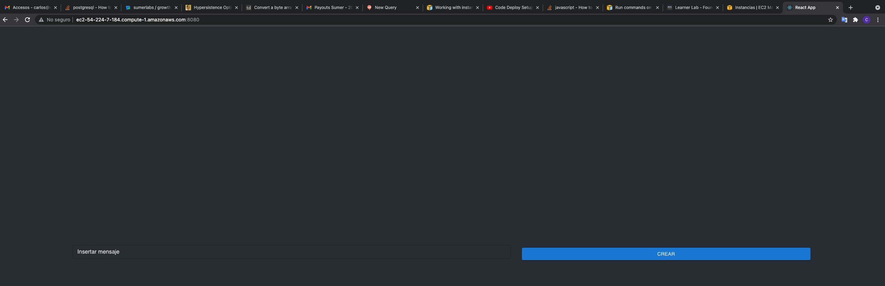

Se muestra como se ejecuta script y se ven los recursos creados 

se valida que el servicio este arriba

se valida que las 3 instancias esten corriendo 

se valida el key pem

se valida el sg generado 

Todo se hace con sdk de golang y para deployar instancias se ejecuta 
programa creado en java previamente con el script que se pasa el generar las instancias
ec2 